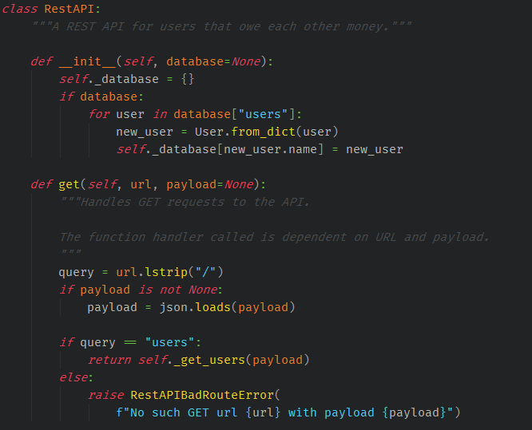

# An Old Hope Theme for PyCharm

Hello, there!

I like the [Old Hope Theme](https://atom.io/themes/an-old-hope-syntax) that was
originally an Atom them and then a VS Code theme and then a theme that went all
over.  But!  I couldn't find a PyCharm one.  So I opened Pycharm and VS Code up
side-by-side and tried to make a PyCharm one that was as close as possible.

May the Force be with your code!

## Installing

As far as I know, *I think* you can place the 'An Old Hope.icls' file in your
"$HOME/PyCharmxx/config/colors" directory, and then open up PyCharm and select
it from the available color themes in your settings.  Let me know if this
doesn't work.

## Contributing

See something you don't like?  I'm happy to take a look at the change.  Submit a
PR (preferably with a before/after screenshot).  I may tell you that I like mine
better and to fork your own version.  But I'll do it nicely.
